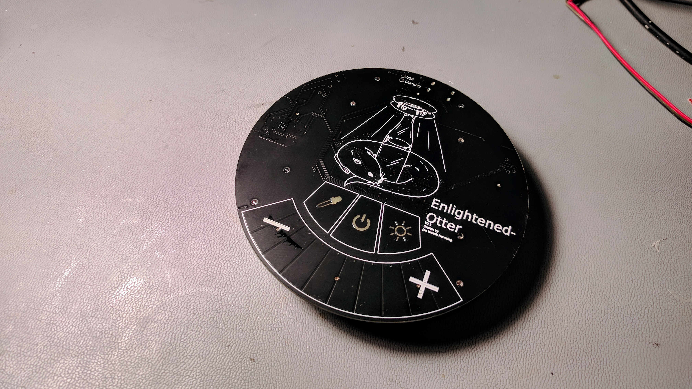
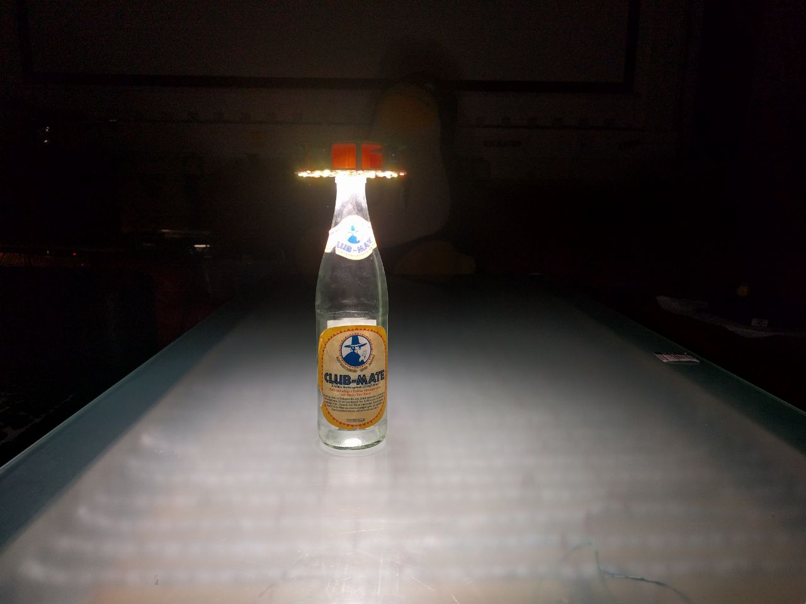
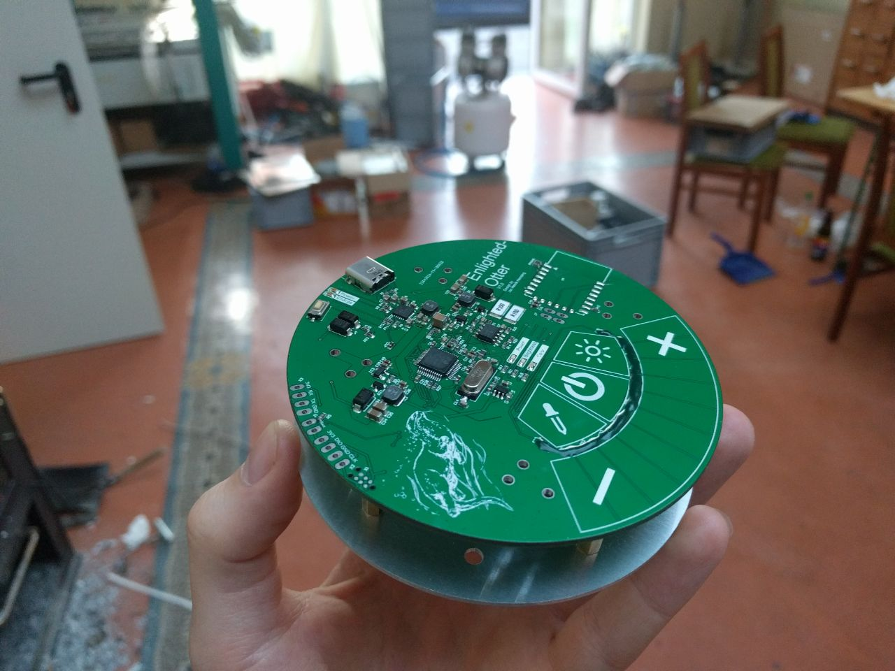
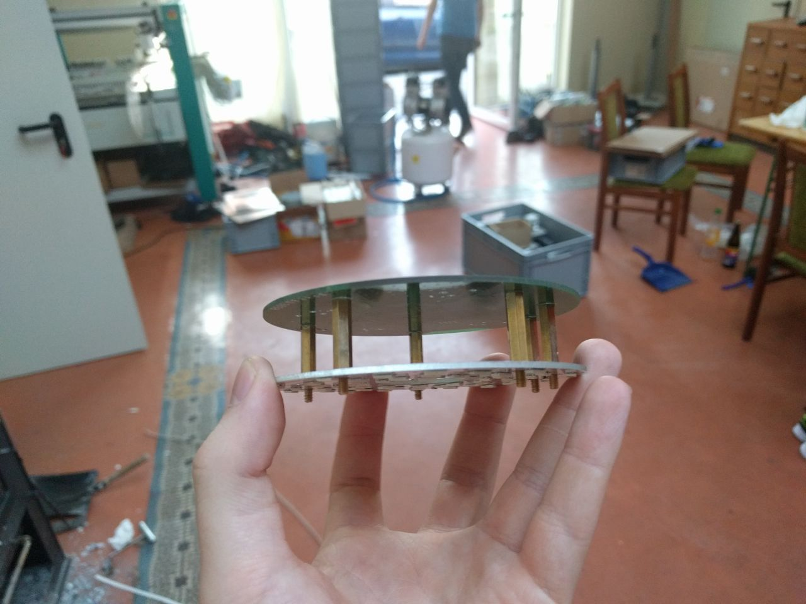
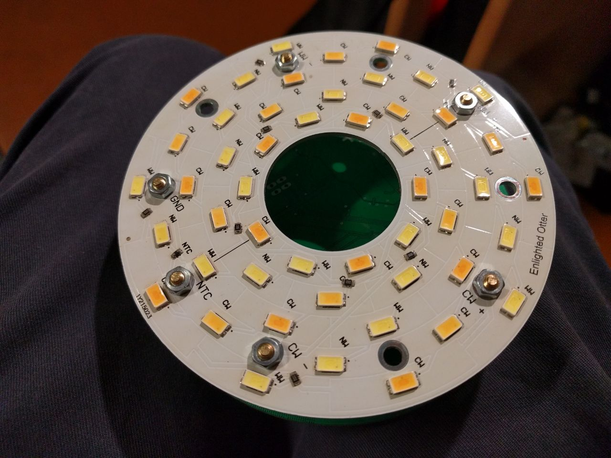

# Enlightened-Otter

Enlightened-Otter is an Open-Source and OSHW work-light for hacker/maker events like the chaos communication congress. It is based upon a STM32F334 with its 
high resolution timer as dual boost 
converter. The main goal is to provide cordless, high CRI, high brightness, flicker-free illumination with a variable color temperature. This is achieved by using LEDs with high a CRI (>93, STW9Q14C) and 
the boost 
converter operating at a frequency of up to 850khz. The PCB also features USB-C (power profile 1) to deliver enough power to charge the 18650 type batteries as well as keep up operation of the boost converter.

Enlightened-Otter can be screwed onto an empty bottle of Mate (or similar), therefore serving with a very small footprint.

## Specs

|								| Typical Value |
| -------------------------		| -------------	|
| I*out* (per channel)	 		| 0-500mA 		|
| V*out* (per channel)			| 0-18.5V 		|
| P*out* (per channel)			| 0-7.5W*		|
| Illuminance (3500k @400mA)	| 1600lx*  		|
| Illuminance (6500k @400mA)	| 2000lx* 		|
| V*in* (USB) 					| 4.8-14V  		|
| I*in* (USB) 					| 3A  			|
| V*bat* 						| 3.8V 			|
| I*bat* (max)					| 5A  			|
| Boost frequency				| 500khz**		|
| I*ripple* (@2.5kHz)			| < 0.5mA 		|

\* Needs to be measured again
 
\** Needs to be evaluated again

## Building and flashing

Change *Inc/defines.h* to fit your desires, then build with

`make clean all`

and flash it via Ozone or st-utils

`st-flash --reset write build/*.bin 0x8000000`

## Images V2.0 & V2.1

## Images V1.1

## Videos

Click to play

#### On a Bottle

#### Boost converter operation

#### TSC operation

#### LED brightness test

## Known Bugs

- Touch does not work when licked (tested by @NiklasFauth)
	- Workaround: Do not lick PCB

## Planning

### Folder structure

- **Src/** : Contains the source files to build the firmware
- **Drivers/** : Contains the STM library files
- **Inc/** : Contains the header files as well as the customization file for the firmare
- **Tools/** : Contains python scripts to generate specific code
- **HW/** : Contains the Schematic, Gerber and other Hawrdware files
- **Images/** : Contains the images used in this repo
- **3D Files/** : Contains the 3D file to be printed as inlet as well as its source
- **/** : Contains other build files e.g. Makefile, linkerscript

### Current state:

PCB V2.1 is here, V2.11 is ordered.

Complete power redesign. HW is flashable, both boost converter work properly up to a current of ~500mA, current regulation works on both boost converters ( < +-0.5mA up to 500mA, regulation frequency is 2.5khz), RT9466 seems to do its job, does work properly on 
batteries, not on USB. Measuring thought the RT does not work, Power down does. LED outputs and Touch inputs work, has correct fault handling.
Advanced User interface is also working, current and color can be set via touch input. Soft on/off works fine. Gamma correcture is applied.
The whole PCB can be shut down by holding the power button.

HW regulates after boot while main loop is basically empty \o/

### To do:

- [ ] measuring throught the RT does not work
- [ ] ADC1 wrong values -> investigate
- [ ] test esp8266
- [ ] implement esp8266
- [ ] visualize battery voltage -> moodlight LEDs
- [ ] Overtemp protection
- [ ] Find more to do's

### Done:

- [x] Implement moodlight LEDs
- [x] touch slider is not super responsive -> investigate
- [x] "Mobile handling"
	- [x] Touch is not that responsive
	- [x] Added filters to touch input
	- [x] Battery low alarm/turnoff -> is implemented, doesnt work, see RT9466 measuring
- [x] everything is super slow when Itarget is 0.0 -> investigate
- [x] UVP
- [x] Port firmware to V2.1
- [x] RT cannot be turned off or cannot charge batteries - investigate
- [x] Optimize code
	- [x] make it less ugly
	- [x] now make it faster
- [x] Test I2C - broken?
	- writing works, reading is buggy, switch to dma
	- [x] implemented DMA
	- [x] Receiving data does not work properly, data is present but not written into the variable
		- switched msb and lsb -.-
- [x] rewrite gamma correction
	- [x] use old one, but interpolate between points
		- didnt work properly, will do later
	- [x] Test it
- [x] find MPP
	- is at ~500khz
- [x] Fix regulator above 180mA
	- is flickering quite alot above 180mA
	- [x] Rewrite regulation, seems to be flickering
		- was gamma correction causing that problem
- [x] HW
	-  See HW/README.md
- [x] Make user Interface more responsive
- [x] Order new PCB (V1.1)
- [x] 3D Design
- [x] get rid of flicker at 0.5-2.5mA 
- [x] temperature calculation
- [x] get rid of global variables
	- moved them into structs
- [x] make the code more Timer/Interrupt based
	- [x] HRTIM
	- [x] HRTIM FLT
	- [x] ADC
	- [x] TSC
	- [x] I2C/UART
	- [x] Regulator
	- [x] UI
- [x] gamma correction
	- [x] write tool to generate gamma correction curve
	- [x] Implement it
	- [x] Test/debug it
- [x] Fix the HRTIM FLT1 line
- [x] Test Injected ADC
	- [x] ADC tested and seems to work just fine
	- [x] Add moving average filter to smooth out ADC values
	- [x] Add JEOC Interrupt
- [x] current calculation
- [x] Fix/write TSC controller
	- [x] Add second TSC bank
	- [x] Make it interrupt based
		- [x] write code
		- [x] Test that
- [x] Fix I2C timing/Interrupt issue
- [x] Get HRTIM to run
- [x] Get the LED's to light up
- [x] Write regulator
	- [x] Write simple, working I regulator
	- [x] Make it cycle time independent
	- [x] Make regulator interrupt based
	- [x] Write a better PI regulator
- [x] Basic TSC,UART,DAC,COMP,I2C and GPIO functionality
- [x] Write the user interface
	- [x] Make it usable
- [x] Readout of touchslider
- [x] Be an otter
- [x] PCB does not burn
